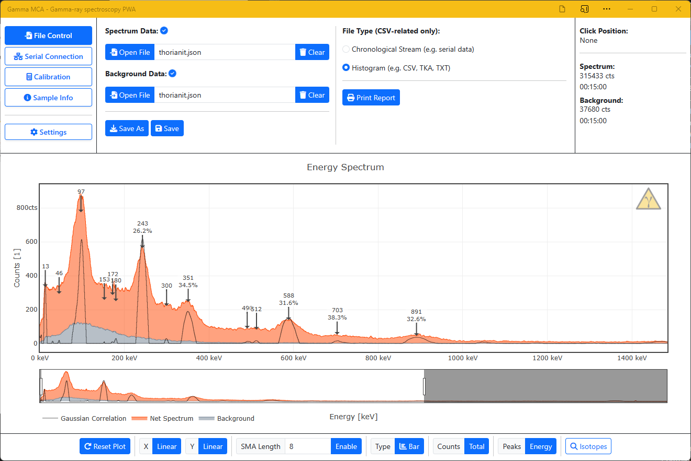
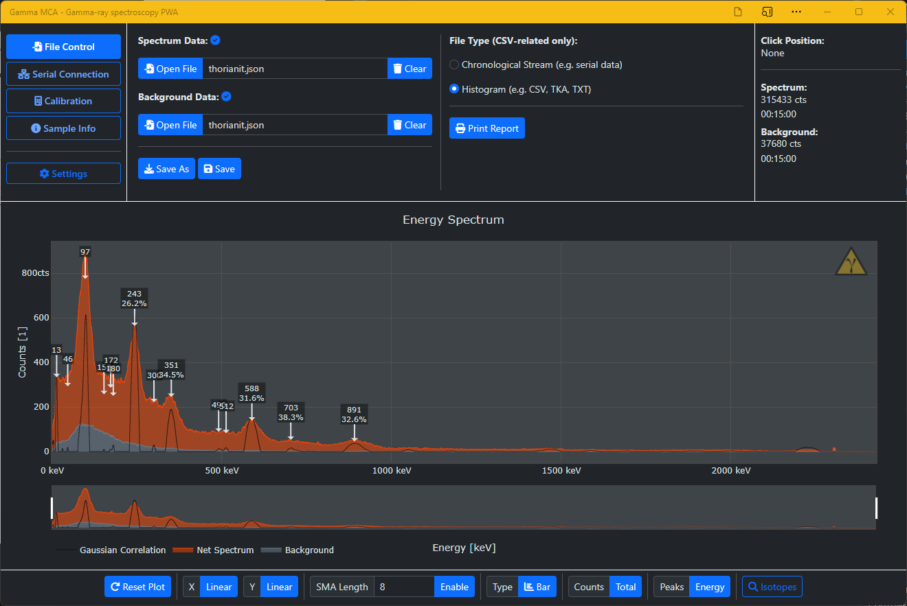

# Gamma MCA

    

Progressive web application for gamma spectroscopy (multi-channel analyzer/MCA) including file and live plot support via the serial interface.

[](https://www.youtube.com/watch?v=dkMhoUwDla0) _(Click image for a short trailer video)_

Built using [Bootstrap](https://github.com/twbs/bootstrap), [Plotly.js](https://github.com/plotly/plotly.js), [Font Awesome](https://github.com/FortAwesome/Font-Awesome), [Z-Schema](https://github.com/zaggino/z-schema) and some more.

## Feature Overview

* No installation required - accessible through every modern browser
* Can be easily installed for stand-alone offline use
* Straightforward interface to get down to business, no hidden submenus
* Probably one of the most beautiful spectrum analyzers out there, includes dark and light modes
* File import of common data formats (e.g. CSV, TKA, XML, JSON)
* Export JSON and XML all-in-one files (includes sample info, calibration, multiple spectra)
* Live plotting via the serial interface, compatible with any serial device (e.g. Arduino) on [desktop](https://caniuse.com/web-serial)
* Compatible with serial (FTDI) chips on [mobile](https://caniuse.com/webusb)
* Serial console to control your device
* Polynomial energy calibration (arbitrary n-th degree)
* Gaussian correlation filtering for auto peak detection (energy and isotope)
* Customizable and comprehensive list of common isotopes and their gamma-ray energies
* Export interactive graphs of your spectrum to embed it into your website
* ... and much more!



## Importing Spectra

There are essentially two types of files you can use - both being text files, e.g. CSVs, XMLs or JSONs:

1. _Chronological streams_ where each new detected event gets printed to the file after the previous one. This includes streams from our [Open Gamma Detector](https://github.com/OpenGammaProject/Open-Gamma-Detector) or any other serial device that has been set up to do so. **Important:** The whole file will be read and the individual events are confined using the delimiter. Whitespace or newlines do not matter. The delimiter can be changed in the settings.
2. Ready-to-use _histograms_. This includes common file types like TKAs, CSVs and also, e.g., RadiaCode 101 XML exports. **Important:** If your file has more than one element per line (CSV), the first one will be regarded as channel index/energy and the second as the number of counts. If there's one element only, it will be regarded as the number of counts instead.

Gamma MCA can import JSON files complying with the [NPES JSON Schema](https://github.com/OpenGammaProject/NPES-JSON).

## Using Serial

Thanks to the WebSerial API and WebUSB you can use any serial device capable of doing gamma spectroscopy or processing the data to plot your spectra. The are two types of prints supported:

1. _Chronological streams_ where each new detected event gets printed to the serial interface after the other. **Important:** Your device has to print a special character (default's a semicolon `;`) after every single event to signalize the end of a data entry. Whitespace or newlines do not matter. The delimiter can be changed in the settings.

Example (4096 channels):

```text
389;874;359;626;551;651;431;3123;466;214;662;1053;467;310;713;319;3001;294;340;493;437;1836;388;
570;354;318;330;688;1343;455;1627;359;252;652;449;602;
329;796;644;414;621;449;663;2311;0;538;224;394;421;444;362;885;406;437;796;994;579;319;456;404;442;922;441;973;
315;642;549;4095;588;774;361;329;1375;499;346;615;794;361;406;4095;457;1028;468;311;321;285;435;514;585;633;670;
```

2. Ready-to-use _histograms_. This data has been pre-processed and the finished histogram will be periodically transmitted. **Important:** Your device has to print a special character (default's a semicolon `;`) after every single histogram channel/bin to signalize the end of a data entry and each new histogram needs to be on a new line (`\n` or e.g., Arduino's `Serial.println(...)`)! The delimiter can be changed in the settings, as well as the correct number of ADC channels that is required for this to work.

Example (4096 channels):

```text
12;0;0;0;0;0;0;0;0;0;0;0;0;0;0;0;0;0;0;0;0;0;0;0;0;0;0;0;0;0;0;0;0;0;0;0;0;0;0;0;0;0;0;0;0;0;0;0;0;0;0;0;0;0;0;0;0;0;0;0;0;0;0;0;0;0;0;0;0;0;0;0;0;0;0;0;0;0;0;0;0;0;0;0;0;0;0;0;0;0;0;0;0;0;0;0;0;0;0;0;0;0;0;0;0;0;0;0;0;0;0;0;0;0;0;0;0;0;0;0;0;0;0;0;0;0;0;0;0;0;0;0;0;0;0;0;0;0;0;0;0;0;0;0;0;0;0;0;0;0;0;0;1;1;1;0;0;0;0;0;0;0;0;0;0;0;0;0;0;0;0;0;0;0;0;0;0;0;0;0;0;0;0;0;0;0;0;0;0;0;1;1;0;0;0;0;0;0;0;0;0;0;0;0;3;0;3;0;4;1;1;0;2;1;1;0;0;1;1;1;1;2;1;0;2;0;0;1;2;1;0;0;0;2;1;1;1;0;1;1;0;1;1;0;0;1;0;1;0;1;0;3;3;1;0;2;0;0;1;2;1;0;0;0;1;2;1;1;0;0;1;0;0;3;0;1;2;0;0;0;0;0;2;0;0;3;2;1;0;0;2;2;0;1;2;1;1;3;3;0;0;1;2;0;0;2;1;2;2;1;2;5;2;0;3;2;1;3;3;3;0;3;2;3;1;3;0;5;4;6;3;0;2;3;1;1;1;4;0;4;3;2;2;3;1;4;3;5;3;5;4;4;4;1;8;3;1;4;2;4;1;4;4;2;2;6;3;2;1;2;1;5;3;2;2;3;3;4;3;2;4;3;3;4;5;1;3;3;5;4;1;5;3;1;4;5;3;2;4;1;6;2;3;2;2;4;4;1;2;1;2;7;3;2;4;0;3;1;2;2;5;2;1;2;3;4;2;6;2;1;2;2;2;3;1;5;5;5;1;3;2;3;5;3;2;4;1;3;2;2;2;0;2;3;0;3;2;3;4;2;4;4;0;2;0;3;3;3;3;2;0;1;1;2;4;4;3;1;2;0;2;2;3;4;1;4;1;1;1;3;2;1;5;4;0;1;0;2;0;3;1;2;5;0;0;0;4;5;3;1;2;0;2;6;3;2;2;2;4;0;0;1;2;3;5;4;2;3;0;2;2;2;3;1;0;0;0;1;2;1;0;1;2;3;1;3;2;2;0;4;0;4;7;0;1;0;3;1;1;1;1;2;1;0;1;2;1;2;1;1;2;0;3;3;0;2;3;0;1;2;2;0;2;0;0;3;2;1;2;0;0;0;0;2;4;1;0;2;1;1;1;1;3;3;1;2;3;4;0;3;4;0;1;1;1;1;0;0;1;2;1;3;0;1;3;0;2;0;0;0;0;0;0;1;2;2;1;2;0;1;0;1;1;3;3;1;1;1;0;2;2;1;1;1;0;0;1;0;0;2;2;1;1;1;1;2;0;2;0;2;1;2;0;1;1;0;0;0;0;0;0;1;1;0;1;0;2;2;2;0;0;2;2;2;1;0;3;2;1;0;1;1;2;1;2;1;1;1;1;0;2;0;1;2;0;0;1;0;0;0;1;0;3;0;0;1;0;1;1;2;1;0;0;0;2;0;0;1;1;1;0;2;0;0;1;0;0;3;0;1;0;1;0;2;0;0;3;1;1;1;0;2;1;0;1;0;0;0;1;0;1;2;0;0;1;0;0;0;1;0;0;0;0;0;0;0;0;0;0;1;1;1;0;3;1;0;2;0;2;0;0;1;0;2;1;0;0;0;0;0;1;2;0;0;0;0;2;0;2;1;1;1;1;0;0;0;1;2;0;0;0;0;1;0;2;0;0;0;0;0;0;0;0;0;1;0;0;0;1;2;3;0;0;0;0;0;0;0;0;1;0;1;0;0;0;0;0;0;0;0;1;0;0;0;1;0;1;1;0;1;0;0;0;0;0;1;0;0;0;0;0;0;0;1;2;0;0;0;1;1;0;0;1;1;0;0;0;0;0;0;1;1;0;0;1;0;1;0;0;0;0;0;1;0;0;1;0;0;0;0;0;0;0;0;0;0;0;0;1;0;0;0;0;0;0;0;0;2;1;0;0;0;0;0;0;1;0;0;0;0;0;0;0;0;0;0;0;1;0;0;0;0;1;1;0;0;0;0;0;0;0;0;0;0;0;0;0;0;0;0;0;0;1;0;1;1;1;0;1;0;0;0;0;0;0;0;1;0;0;1;0;0;0;0;0;0;0;0;0;0;0;0;1;0;0;0;1;0;1;0;0;0;0;0;0;0;0;0;0;0;0;0;0;0;0;0;1;0;0;0;0;0;0;1;0;1;0;1;1;0;0;0;0;0;0;0;0;1;2;1;0;1;0;0;0;0;0;0;0;1;0;0;0;1;0;0;0;0;1;0;1;0;0;0;0;0;0;0;0;0;0;3;0;0;0;1;0;0;1;0;0;1;0;0;0;0;0;1;1;0;0;1;0;0;0;0;0;0;0;0;0;0;0;0;0;0;0;0;0;0;1;1;0;0;0;0;0;0;0;0;0;1;0;0;0;0;0;0;0;0;0;0;1;0;0;0;0;0;0;0;0;0;0;0;0;0;0;0;0;0;0;0;0;0;0;1;0;0;0;0;0;0;0;0;0;0;0;2;0;0;0;0;0;0;0;1;0;0;1;0;0;0;0;0;0;0;0;0;0;0;1;0;0;0;0;0;0;0;0;0;0;0;0;0;0;0;0;0;0;0;0;0;0;0;0;0;0;0;0;1;0;0;0;0;0;0;0;0;0;0;1;0;0;0;0;0;0;0;0;0;0;0;1;0;0;0;0;0;0;1;0;0;0;0;0;1;0;1;0;0;0;0;0;0;0;0;0;0;0;0;0;0;0;0;0;1;0;0;0;0;1;0;0;0;0;0;0;0;0;0;0;0;0;1;1;0;0;1;0;1;0;0;0;0;0;0;0;0;0;0;0;0;0;1;0;0;0;0;0;0;0;0;0;0;0;0;0;0;0;0;0;0;0;0;0;0;0;0;1;0;0;0;0;0;0;1;0;0;0;0;0;0;0;0;0;0;1;0;0;0;0;0;0;0;1;0;0;0;0;0;0;0;0;0;0;0;0;1;0;0;0;0;0;0;0;0;0;0;0;0;0;0;0;0;0;0;0;0;0;0;0;0;0;0;0;0;0;0;0;1;0;0;1;0;0;0;0;1;0;0;0;0;0;0;0;0;0;0;0;1;0;0;0;0;0;1;0;0;0;0;0;0;0;0;0;0;0;0;0;0;0;0;0;1;0;0;0;0;0;0;0;0;1;0;0;0;0;0;0;0;0;0;0;0;0;0;0;0;0;0;0;0;0;0;0;2;1;0;0;0;1;0;0;0;0;0;0;0;0;0;0;0;1;0;0;0;1;0;0;0;0;0;0;0;0;0;0;0;0;0;0;0;0;0;0;0;0;0;0;0;0;0;0;0;1;0;0;0;0;0;0;0;0;0;0;0;0;0;0;0;0;0;0;0;0;1;0;0;0;1;0;0;0;1;0;0;0;0;0;0;0;0;0;0;0;0;1;0;0;0;0;0;0;0;0;0;0;0;0;0;0;0;0;0;0;0;0;1;0;0;0;0;0;0;0;0;0;0;0;0;0;0;0;0;1;0;0;0;0;0;0;0;0;0;0;0;0;0;0;0;0;0;0;0;0;0;0;0;0;0;0;0;0;0;0;0;0;0;0;0;0;0;0;0;0;0;0;0;0;0;0;0;0;1;0;0;0;0;0;0;0;0;0;1;0;0;0;0;0;0;0;0;0;0;0;0;0;0;0;0;0;0;0;0;0;0;0;0;0;0;0;0;0;0;0;0;0;0;0;0;0;0;0;0;0;0;0;0;0;0;0;0;1;1;0;1;0;0;1;0;0;0;0;0;0;0;0;0;0;0;0;0;0;0;0;0;0;0;0;1;0;0;0;0;0;0;0;0;0;0;0;0;0;0;0;0;0;0;0;0;0;0;0;0;0;0;0;0;0;0;0;0;0;0;0;1;0;0;0;0;1;0;0;0;0;0;0;0;0;0;0;0;0;0;0;0;1;0;0;0;0;0;0;0;0;0;0;0;0;0;0;0;0;0;0;0;0;0;0;0;0;0;0;0;2;0;0;0;0;0;0;0;0;0;0;0;0;0;0;0;0;0;0;0;0;0;0;0;0;0;0;0;0;0;0;0;0;0;0;0;0;0;1;0;0;0;0;0;0;1;0;0;0;0;0;0;0;0;0;0;0;0;0;1;0;0;0;0;0;0;0;1;0;0;1;0;0;0;0;0;0;0;0;0;0;0;0;0;0;0;0;0;0;0;0;0;0;0;0;0;0;1;0;0;0;0;0;0;0;0;0;0;0;0;0;0;0;0;0;0;0;0;0;0;0;0;0;0;0;0;0;0;0;0;0;0;0;0;0;0;0;0;0;1;0;0;0;0;0;0;0;0;0;0;0;0;0;0;0;0;0;0;0;0;0;0;0;0;0;0;0;0;0;0;0;0;0;0;0;0;0;0;0;0;0;0;0;0;0;0;0;0;0;0;0;0;0;0;0;0;0;0;0;0;0;0;0;0;0;0;0;0;0;0;0;0;0;0;0;0;0;0;0;0;0;0;0;0;0;0;0;0;0;0;1;0;0;0;0;0;0;0;0;0;0;0;0;0;0;0;0;0;0;0;0;1;0;0;0;0;0;0;0;0;0;0;0;0;0;0;0;0;0;0;0;0;0;0;0;0;0;0;0;0;0;0;0;0;0;0;0;0;0;1;0;0;0;0;0;0;0;0;0;0;0;0;0;0;0;0;0;1;0;0;0;1;0;0;0;0;0;0;0;0;0;0;0;0;0;0;0;0;0;0;0;0;0;1;0;0;0;0;0;0;0;0;0;0;0;0;0;0;0;0;0;0;1;0;0;0;0;0;0;0;0;0;1;0;0;0;0;0;0;0;0;0;0;0;0;0;0;0;0;0;0;0;0;0;1;0;1;0;0;0;0;0;0;0;0;0;0;0;0;0;0;0;0;0;0;0;0;0;0;0;0;0;0;0;0;0;0;0;0;0;0;0;0;0;0;0;0;0;0;0;0;0;0;0;0;0;0;0;0;0;0;0;0;0;0;0;0;1;0;0;0;0;0;0;0;0;0;0;0;0;0;0;0;0;0;0;0;0;0;0;0;0;0;0;0;0;0;0;0;0;0;0;0;0;0;0;0;0;1;0;0;0;0;0;0;0;0;0;0;0;0;0;0;0;0;0;0;0;0;0;0;0;0;0;0;0;0;0;0;0;0;0;0;0;0;0;0;1;0;0;0;0;0;0;0;0;0;0;0;0;0;0;0;0;0;0;0;0;0;0;0;0;0;0;0;0;0;0;0;0;0;0;0;0;0;0;0;0;0;0;0;0;0;0;0;0;1;0;0;0;0;0;0;0;0;0;0;0;0;0;0;0;0;1;0;0;0;0;0;0;0;0;0;0;0;0;0;0;0;0;0;0;0;0;0;0;0;0;1;0;0;0;0;0;0;1;0;0;0;0;0;0;0;0;0;0;0;0;0;0;0;0;0;0;0;0;0;0;0;0;0;0;0;0;0;0;0;0;0;1;0;0;0;0;0;0;0;0;0;0;0;0;0;0;0;0;0;0;0;0;0;0;0;0;0;0;0;0;0;0;0;0;0;0;0;0;0;0;0;0;0;0;0;0;0;0;0;0;0;0;0;0;0;0;0;0;0;0;0;0;0;0;0;0;0;0;0;0;0;0;0;0;0;0;0;0;0;0;0;0;0;1;0;0;0;0;0;0;0;0;0;0;0;0;0;0;0;0;0;0;0;0;0;0;0;0;0;0;0;0;0;0;0;0;0;0;0;0;0;0;0;0;0;0;0;0;0;0;0;0;0;0;0;0;0;0;0;0;0;0;0;0;0;0;0;0;0;0;0;0;0;0;0;0;0;0;0;0;0;0;0;0;1;0;0;0;0;0;0;0;0;0;0;0;1;0;0;0;0;0;0;0;0;0;0;0;0;0;0;0;0;0;0;0;0;0;0;0;0;0;0;0;0;0;0;0;0;0;0;0;1;0;0;0;0;0;0;0;0;0;0;0;0;0;0;0;0;0;0;0;0;0;0;0;0;0;0;0;0;0;0;0;0;0;0;0;0;0;0;0;0;0;0;0;0;0;0;0;0;0;0;0;0;0;0;0;0;0;0;0;0;0;0;0;0;0;0;0;0;0;0;0;0;0;0;0;0;0;0;0;0;0;0;0;0;0;0;0;0;0;0;0;0;0;0;0;0;0;0;0;0;0;0;0;0;0;0;0;0;0;0;0;0;0;0;0;0;0;0;0;0;0;0;0;0;0;0;0;0;0;0;0;0;0;0;0;0;0;0;0;0;0;0;0;0;0;0;0;0;0;0;0;0;0;0;0;0;0;1;0;0;0;0;0;0;0;0;0;0;0;0;0;0;1;0;0;0;0;0;0;0;0;0;0;0;0;0;0;0;0;0;0;0;0;0;0;0;0;0;0;0;0;0;0;0;0;0;0;0;0;0;1;0;0;0;0;0;0;0;0;0;0;0;0;0;0;0;0;0;0;0;0;0;0;0;0;0;0;0;0;0;1;0;0;0;0;0;0;0;0;0;0;0;0;0;0;0;0;0;0;0;0;0;0;0;0;0;1;0;0;0;0;0;0;0;0;0;0;1;0;0;0;0;0;0;0;0;0;0;0;0;0;0;0;0;0;0;0;0;0;0;0;0;0;0;0;0;0;0;0;0;0;0;0;0;0;0;0;0;0;0;0;0;0;0;0;0;0;0;0;0;0;0;0;0;0;0;0;0;0;0;0;0;0;0;0;0;0;0;0;0;0;0;0;0;0;0;0;0;0;0;0;0;0;0;0;0;0;0;0;0;0;0;0;0;0;0;0;0;0;0;0;0;0;0;0;0;0;0;2;0;0;0;0;0;0;0;0;0;0;0;0;0;0;0;0;0;0;0;0;0;0;0;0;0;0;0;0;0;0;0;0;0;0;0;0;0;0;0;0;0;0;0;0;0;0;0;0;0;0;0;0;0;0;0;0;0;0;0;0;0;0;0;0;0;0;0;0;0;0;0;0;0;0;0;0;0;0;0;0;0;0;0;0;0;0;0;0;0;0;0;0;0;0;0;0;0;0;0;0;0;0;0;0;0;0;0;0;0;1;0;0;0;0;0;0;0;0;0;0;0;0;0;0;0;0;0;0;0;0;0;0;0;0;0;0;0;0;0;0;0;0;0;0;0;0;0;0;0;0;0;0;0;0;0;0;0;0;0;0;0;0;0;0;0;0;0;0;0;0;0;0;0;0;0;0;0;0;0;0;0;0;0;0;0;0;0;0;0;0;0;0;0;0;0;0;0;0;0;0;0;0;0;0;0;0;0;0;0;0;0;0;0;0;0;0;0;0;0;0;0;0;0;0;0;0;0;0;0;0;0;0;0;0;0;0;0;0;0;0;0;0;0;0;0;0;0;0;0;0;0;0;0;0;0;0;0;0;0;0;0;0;0;0;0;0;0;0;0;0;0;0;0;0;0;0;0;0;0;0;0;0;0;0;0;0;0;0;0;0;0;0;0;0;0;0;0;0;0;0;0;0;0;0;0;0;0;0;0;0;0;0;0;0;0;0;0;0;0;0;0;0;0;0;0;0;0;0;0;0;0;0;0;0;0;0;0;0;0;0;0;0;0;0;0;0;0;0;0;0;0;0;0;0;0;0;0;0;0;0;0;0;0;0;0;0;0;0;0;0;0;0;0;0;0;0;0;0;0;0;0;0;0;0;0;0;0;0;0;0;0;0;0;0;0;0;0;0;0;0;0;0;0;0;0;0;0;0;0;0;0;0;0;0;0;0;0;0;0;0;0;0;0;0;0;0;0;0;0;0;0;0;0;0;0;0;0;0;0;0;0;0;0;0;0;0;0;0;0;0;0;0;0;0;0;0;0;0;0;0;0;0;0;0;0;0;0;0;0;0;0;0;0;0;0;0;0;0;0;0;0;0;0;0;0;0;0;0;0;0;0;0;0;0;0;0;0;0;0;0;0;0;0;0;0;0;0;0;0;0;0;0;0;0;0;0;0;0;0;0;0;0;0;0;0;0;0;0;0;0;0;0;0;0;0;0;0;0;0;0;0;0;0;0;0;0;0;0;0;0;0;0;0;0;0;0;0;0;0;0;0;0;0;0;0;0;0;0;0;0;0;0;0;0;0;0;0;0;0;0;0;0;0;0;0;0;0;0;0;0;0;0;0;0;0;0;0;0;0;0;0;0;0;0;0;0;0;0;0;0;0;0;0;0;0;0;0;0;0;0;0;0;0;0;0;0;0;0;0;0;0;0;0;0;0;0;0;0;0;0;0;0;0;0;0;0;0;0;0;0;0;0;0;0;0;0;0;0;0;0;0;0;0;0;0;0;0;0;0;0;0;0;0;0;0;0;0;0;0;0;0;0;0;0;0;0;0;0;0;0;0;0;0;0;0;0;0;0;0;0;0;0;0;0;0;0;0;0;0;0;0;0;0;0;0;0;0;0;0;0;0;0;0;0;0;0;0;0;0;0;0;0;0;0;0;0;0;0;0;0;0;0;0;0;0;0;0;0;0;0;0;0;0;0;0;0;0;0;0;0;0;0;0;0;0;0;0;0;0;0;0;0;0;0;0;0;0;0;0;0;0;0;0;0;0;0;0;0;0;0;0;0;0;0;0;0;0;0;0;0;0;0;0;0;0;0;0;0;0;0;0;0;0;0;0;0;0;0;0;0;0;0;0;0;0;0;0;0;0;0;0;0;0;0;0;0;0;0;0;0;0;0;0;0;0;0;0;0;0;0;0;0;0;0;0;0;0;0;0;0;0;0;0;0;0;0;0;0;1;0;0;0;0;0;0;0;0;0;0;0;0;0;0;0;0;0;0;0;0;0;0;0;0;0;0;0;0;0;0;0;0;0;0;0;0;0;0;0;0;0;0;0;0;0;0;0;0;0;0;0;0;0;0;0;0;0;0;0;0;0;0;0;0;0;0;0;0;0;0;0;0;0;0;0;0;0;0;0;0;0;0;0;0;0;0;0;0;0;0;0;0;0;0;0;0;0;0;0;0;0;0;4;
13;0;0;0;0;0;0;0;0;0;0;0;0;0;0;0;0;0;0;0;0;0;0;0;0;0;0;0;0;0;0;0;0;0;0;0;0;0;0;0;0;0;0;0;0;0;0;0;0;0;0;0;0;0;0;0;0;0;0;0;0;0;0;0;0;0;0;0;0;0;0;0;0;0;0;0;0;0;0;0;0;0;0;0;0;0;0;0;0;0;0;0;0;0;0;0;0;0;0;0;0;0;0;0;0;0;0;0;0;0;0;0;0;0;0;0;0;0;0;0;0;0;0;0;0;0;0;0;0;0;0;0;0;0;0;0;0;0;0;0;0;0;0;0;0;0;0;0;0;0;0;0;1;1;1;0;0;0;0;0;0;0;0;0;0;0;0;0;0;0;0;0;0;0;0;0;0;0;0;0;0;0;0;0;0;0;0;0;0;0;1;1;0;0;0;0;0;0;0;0;0;0;0;0;3;0;3;0;4;1;1;0;2;1;1;0;0;1;1;1;1;2;1;0;2;0;0;1;2;1;0;0;0;2;1;1;1;0;1;1;0;1;1;0;0;1;0;1;0;1;0;3;3;1;0;2;0;0;1;2;1;0;0;0;1;2;1;1;0;0;1;0;0;3;0;1;2;0;0;0;0;0;3;0;0;3;2;1;0;0;2;2;0;1;2;1;1;4;3;0;0;1;2;0;0;2;1;2;3;1;2;5;2;0;3;2;1;3;3;3;0;3;2;3;1;3;0;5;4;6;3;0;2;3;1;1;1;4;0;4;3;2;2;3;1;4;3;5;3;5;4;4;4;1;8;3;1;4;2;4;1;4;4;2;2;7;3;2;1;2;1;5;3;2;2;3;3;4;3;2;4;3;3;4;5;1;3;3;5;4;1;5;3;1;4;5;3;2;4;1;6;2;3;2;3;4;4;1;2;1;2;8;3;2;4;0;3;1;2;2;5;2;1;2;3;4;2;6;2;1;2;2;2;3;1;5;5;5;1;3;3;3;5;3;2;4;1;3;2;2;2;0;2;3;0;3;2;3;4;2;4;4;0;2;0;3;3;3;3;2;1;1;1;2;4;4;3;1;2;0;2;2;3;4;1;4;1;1;1;3;2;1;5;4;0;1;0;2;0;3;1;2;5;0;0;0;4;5;3;3;2;0;2;6;3;2;2;2;4;0;0;1;2;3;5;4;2;3;0;2;2;2;3;1;0;0;0;1;2;1;0;1;2;3;1;3;2;2;0;4;0;4;8;0;1;0;3;1;1;1;1;2;1;0;1;2;2;2;1;1;2;0;3;3;0;2;3;0;2;2;2;0;2;0;0;3;2;1;2;0;0;0;0;2;4;1;0;2;1;1;1;1;3;3;1;2;3;4;0;3;4;0;1;1;1;1;0;0;1;2;1;3;0;1;3;0;2;0;0;0;0;0;0;1;2;2;1;2;0;1;0;1;1;3;3;1;1;1;0;2;2;1;1;1;0;0;1;0;0;2;2;1;1;1;1;2;0;2;0;2;1;2;0;1;1;0;0;0;0;0;0;1;1;0;1;0;2;2;2;0;0;2;2;2;1;0;3;2;1;0;1;1;2;1;2;1;1;1;1;0;2;0;1;2;0;0;1;0;0;0;1;0;3;0;0;1;0;1;1;2;1;0;0;0;2;0;0;1;1;1;0;2;0;0;1;0;0;3;0;1;0;1;0;2;0;0;3;1;1;1;0;2;1;0;1;0;0;0;1;0;1;2;0;0;1;0;0;0;1;0;0;0;0;0;0;0;0;0;0;1;1;1;0;3;1;0;2;0;2;0;0;1;0;2;1;0;0;0;0;0;1;2;0;0;0;0;3;0;2;1;1;1;1;0;0;0;1;2;0;0;0;0;1;0;2;0;0;0;0;0;0;0;0;0;1;0;0;0;1;2;3;0;0;0;0;0;0;0;0;1;0;1;0;0;0;0;0;0;0;0;1;0;0;0;1;0;1;1;0;1;0;0;0;0;0;1;0;0;0;0;0;0;0;1;2;0;0;0;1;1;0;0;1;1;0;0;0;0;0;0;1;1;0;0;1;0;1;0;0;0;0;0;1;0;0;1;0;0;0;0;0;0;0;0;0;0;0;0;1;0;0;0;0;0;0;0;0;2;1;0;0;0;0;0;0;1;0;0;0;0;0;0;0;0;0;0;0;1;0;0;0;0;1;1;0;0;0;0;0;0;0;0;0;0;1;0;0;0;0;0;0;0;1;0;1;1;1;0;1;0;0;0;0;0;0;0;1;0;0;1;0;0;0;0;0;0;0;0;0;0;0;0;1;0;0;0;1;0;1;0;0;0;0;0;0;0;0;0;0;0;0;0;0;0;0;0;1;0;0;0;0;0;0;1;0;1;0;1;1;0;0;0;0;0;0;0;0;1;2;1;0;1;0;0;0;0;0;0;0;1;0;0;0;1;0;0;0;0;1;0;1;0;0;0;0;0;0;0;0;0;0;3;0;0;0;1;0;0;1;0;0;1;0;0;0;0;0;1;1;0;0;1;0;0;0;0;0;0;0;0;0;0;0;0;0;0;0;0;0;0;1;1;0;0;0;0;0;0;0;0;0;1;0;0;0;0;0;0;0;0;0;0;1;0;0;0;0;0;0;0;0;0;0;0;0;0;0;0;0;0;0;0;0;0;0;1;0;0;0;0;0;1;0;0;0;0;0;2;0;0;0;0;0;0;0;1;0;0;1;0;0;0;0;0;0;0;0;0;0;0;1;0;0;0;0;0;0;0;0;0;0;0;0;0;0;0;0;0;0;0;0;0;0;0;0;0;0;0;0;1;0;0;0;0;0;0;0;0;0;0;1;0;0;0;0;0;0;0;0;0;0;0;1;0;0;0;0;0;0;1;0;0;0;0;0;1;0;1;0;0;0;0;0;0;0;0;0;0;0;0;0;0;0;0;0;1;0;0;0;0;1;0;0;0;0;0;0;0;0;0;0;0;0;1;1;0;0;1;0;1;0;0;0;0;0;0;0;0;0;0;0;0;0;1;0;0;0;0;0;0;0;0;0;0;0;0;0;0;0;0;0;0;0;0;0;0;0;0;1;0;0;0;0;0;0;1;0;0;0;0;0;0;0;0;0;0;1;0;0;0;0;0;0;0;1;0;0;0;0;0;0;0;0;0;0;0;0;1;0;0;0;0;0;0;0;0;0;0;0;0;0;0;0;0;0;0;0;0;0;0;0;0;0;0;0;0;0;0;0;1;0;0;1;0;0;0;0;1;0;0;0;0;0;0;0;0;0;0;0;1;0;0;0;0;0;1;1;0;0;0;0;0;0;0;0;0;0;0;0;0;0;0;0;1;0;0;0;0;0;0;0;0;1;0;0;0;0;0;0;0;0;0;0;0;0;0;0;0;0;0;0;0;0;0;0;2;1;0;0;0;1;0;0;0;0;0;0;0;0;0;0;0;1;0;0;0;1;0;0;0;0;0;0;0;0;0;0;0;0;0;0;0;0;0;0;0;0;0;0;0;0;0;0;0;1;0;0;0;0;0;0;0;0;0;0;0;0;0;0;0;0;0;0;0;0;1;0;0;0;1;0;0;0;1;0;0;0;0;0;0;0;0;0;0;0;0;1;0;0;0;0;0;0;0;0;0;0;0;0;0;0;0;0;0;0;0;0;1;0;0;0;0;0;0;0;0;0;0;0;0;0;0;0;0;1;0;0;0;0;0;0;0;0;0;0;0;0;0;0;0;0;0;0;0;0;0;0;0;0;0;0;0;0;0;0;0;0;0;0;0;0;0;0;0;0;0;0;0;0;0;0;0;0;1;0;0;0;0;0;0;0;0;0;1;0;0;0;0;0;0;0;0;0;0;0;0;0;0;0;0;0;0;0;0;0;0;0;0;0;0;0;0;0;0;0;0;0;0;0;0;0;0;0;0;0;0;0;0;0;0;0;0;1;1;0;1;0;0;1;0;0;0;0;0;0;0;0;0;0;0;0;0;0;0;0;0;0;0;0;1;0;0;0;0;0;0;0;0;0;0;0;0;0;0;0;0;0;0;0;0;0;0;0;0;0;0;0;0;0;0;0;0;0;0;0;1;0;0;0;0;1;0;0;0;0;0;0;0;0;0;0;0;0;0;0;0;1;0;0;0;0;0;0;0;0;0;0;0;0;0;0;0;0;0;0;0;0;0;0;0;0;0;0;0;2;0;0;0;0;0;0;0;0;0;0;0;0;0;0;0;0;0;0;0;0;0;0;0;0;0;0;0;0;0;0;0;0;0;0;0;0;0;1;0;0;0;0;0;0;1;0;0;0;0;0;0;0;0;0;0;0;0;0;1;0;0;0;0;0;0;0;1;0;0;1;0;0;0;0;0;0;0;0;0;0;0;0;0;0;0;0;0;0;0;0;0;0;0;0;0;0;1;0;0;0;0;0;0;0;0;0;0;0;0;0;0;0;0;0;0;0;0;0;0;0;0;0;0;0;0;0;0;0;0;0;0;0;0;0;0;0;0;0;1;0;0;0;0;0;0;0;0;0;0;0;0;0;0;0;0;0;0;0;0;0;0;0;0;0;0;0;0;0;0;0;0;0;0;0;0;0;0;0;0;0;0;0;0;0;0;0;0;0;0;0;0;0;0;0;0;0;0;0;0;0;0;0;0;0;0;0;0;0;0;0;0;0;0;0;0;0;0;0;0;0;0;0;0;0;0;0;0;0;0;1;0;0;0;0;0;0;0;0;0;0;0;0;0;0;0;0;0;0;0;0;1;0;0;0;0;0;0;0;0;0;0;0;0;0;0;0;0;0;0;0;0;0;0;0;0;0;0;0;0;0;0;0;0;0;0;0;0;0;1;0;0;0;0;0;0;0;0;0;0;0;0;0;0;0;0;0;1;0;0;0;1;0;0;0;0;0;0;0;0;0;0;0;0;0;0;0;0;0;0;0;0;0;1;0;0;0;0;0;0;0;0;0;0;0;0;0;0;0;0;0;0;1;0;0;0;0;0;0;0;0;0;1;0;0;0;0;0;0;0;0;0;0;0;0;0;0;0;0;0;0;0;0;0;1;0;1;0;0;0;0;0;0;0;0;0;0;0;0;0;0;0;0;0;0;0;0;0;0;0;0;0;0;0;0;0;0;0;0;0;0;0;0;0;0;0;0;0;0;0;0;0;0;0;0;0;0;0;0;0;0;0;0;0;0;0;0;1;0;0;0;0;0;0;0;0;0;0;0;0;0;0;0;0;0;0;0;0;0;0;0;0;0;0;0;0;0;0;1;0;0;0;0;0;0;0;0;0;1;0;0;0;0;0;0;0;0;0;0;0;0;0;0;0;0;0;0;0;0;0;0;0;0;0;0;0;0;0;0;0;0;0;0;0;0;0;0;1;0;0;0;0;0;0;0;0;0;0;0;0;0;0;0;0;0;0;0;0;0;0;0;0;0;0;0;0;0;0;0;0;0;0;0;0;0;0;0;0;0;0;0;0;0;0;0;0;1;0;0;0;0;0;0;0;0;0;0;0;0;0;0;0;0;1;0;0;0;0;0;0;0;0;0;0;0;0;0;0;0;0;0;0;0;0;0;0;0;0;1;0;0;0;0;0;0;1;0;0;0;0;0;0;0;0;0;0;0;0;0;0;0;0;0;0;0;0;0;0;0;0;0;0;0;0;0;0;1;0;0;1;0;0;0;0;0;0;0;0;0;0;0;0;0;0;0;0;0;0;0;0;0;0;0;0;0;0;0;0;0;0;0;0;0;0;0;0;0;0;0;0;0;0;0;0;0;0;0;0;0;0;0;0;0;0;0;0;0;0;0;0;0;0;0;0;0;0;0;0;0;0;0;0;0;0;0;0;0;0;0;0;0;1;0;0;0;0;0;0;0;0;0;0;0;0;0;0;0;0;0;0;0;0;0;0;0;0;0;0;0;0;0;0;0;0;0;0;0;0;0;0;0;0;0;0;0;0;0;0;0;0;0;0;0;0;0;0;0;0;0;0;0;0;0;0;0;0;0;0;0;0;0;0;0;0;0;0;0;0;0;0;0;0;1;0;0;0;0;0;0;0;0;0;0;0;1;0;0;0;0;0;0;0;0;0;0;0;0;0;0;0;0;0;0;0;0;0;0;0;0;0;0;0;0;0;0;0;0;0;0;0;1;0;0;0;0;0;0;0;0;0;0;0;0;0;0;0;0;0;0;0;0;0;0;0;0;0;0;0;0;0;0;0;0;0;0;0;0;0;0;0;0;0;0;0;0;0;0;0;0;0;0;0;0;0;0;0;0;0;0;0;0;0;0;0;0;0;0;0;0;0;0;0;0;0;0;0;0;0;0;0;0;0;0;0;0;0;0;0;0;0;0;0;0;0;0;0;0;0;0;0;0;0;0;0;0;0;0;0;0;0;0;0;0;0;0;0;0;0;0;0;0;0;0;0;0;0;0;0;0;0;0;0;0;0;0;0;0;0;0;0;0;0;0;0;0;0;0;0;0;0;0;0;0;0;0;0;0;0;1;0;0;0;0;0;0;0;0;0;0;0;0;0;0;1;0;0;0;0;0;0;0;0;0;0;0;0;0;0;0;0;0;0;0;0;0;0;0;0;0;0;0;0;0;0;0;0;0;0;0;0;0;1;0;0;0;0;0;0;0;0;0;0;0;0;0;0;0;0;0;0;0;0;0;0;0;0;0;0;0;0;0;1;0;0;0;0;0;0;0;0;0;0;0;0;0;0;0;0;0;0;0;0;0;0;0;0;0;1;0;0;0;0;0;0;0;0;0;0;1;0;0;0;0;0;0;0;0;0;0;0;0;0;0;0;0;0;0;0;0;0;0;0;0;0;0;0;0;0;0;0;0;0;0;0;0;0;0;0;0;0;0;0;0;0;0;0;0;0;0;0;0;0;0;0;0;0;0;0;0;0;0;0;0;0;0;0;0;0;0;0;0;0;0;0;0;0;0;0;0;0;0;0;0;0;0;0;0;0;0;0;0;0;0;0;0;0;0;0;0;0;0;0;0;0;0;0;0;0;0;2;0;0;0;0;0;0;0;0;0;0;0;0;0;0;0;0;0;0;0;0;0;0;0;0;0;0;0;0;0;0;0;0;0;0;0;0;0;0;0;0;0;0;0;0;0;0;0;0;0;0;0;0;0;0;0;0;0;0;0;0;0;0;0;0;0;0;0;0;0;0;0;0;0;0;0;0;0;0;0;0;0;0;0;0;0;0;0;0;0;0;0;0;0;0;0;0;0;0;0;0;0;0;0;0;0;0;0;0;0;1;0;0;0;0;0;0;0;0;0;0;0;0;0;0;0;0;0;0;0;0;0;0;0;0;0;0;0;0;0;0;0;0;0;0;0;0;0;0;0;0;0;0;0;0;0;0;0;0;0;0;0;0;0;0;0;0;0;0;0;0;0;0;0;0;0;0;0;0;0;0;0;0;0;0;0;0;0;0;0;0;0;0;0;0;0;0;0;0;0;0;0;0;0;0;0;0;0;0;0;0;0;0;0;0;0;0;0;0;0;0;0;0;0;0;0;0;0;0;0;0;0;0;0;0;0;0;0;0;0;0;0;0;0;0;0;0;0;0;0;0;0;0;0;0;0;0;0;0;0;0;0;0;0;0;0;0;0;0;0;0;0;0;0;0;0;0;0;0;0;0;0;0;0;0;0;0;0;0;0;0;0;0;0;0;0;0;0;0;0;0;0;0;0;0;0;0;0;0;0;0;0;0;0;0;0;0;0;0;0;0;0;0;0;0;0;0;0;0;0;0;0;0;0;0;0;0;0;0;0;0;0;0;0;0;0;0;0;0;0;0;0;0;0;0;0;0;0;0;0;0;0;0;0;0;0;0;0;0;0;0;0;0;0;0;0;0;0;0;0;0;0;0;0;0;0;0;0;0;0;0;0;0;0;0;0;0;0;0;0;0;0;0;0;0;0;0;0;0;0;0;0;0;0;0;0;0;0;0;0;0;0;0;0;0;0;0;0;0;0;0;0;0;0;0;0;0;0;0;0;0;0;0;0;0;0;0;0;0;0;0;0;0;0;0;0;0;0;0;0;0;0;0;0;0;0;0;0;0;0;0;0;0;0;0;0;0;0;0;0;0;0;0;0;0;0;0;0;0;0;0;0;0;0;0;0;0;0;0;0;0;0;0;0;0;0;0;0;0;0;0;0;0;0;0;0;0;0;0;0;0;0;0;0;0;0;0;0;0;0;0;0;0;0;0;0;0;0;0;0;0;0;0;0;0;0;0;0;0;0;0;0;0;0;0;0;0;0;0;0;0;0;0;0;0;0;0;0;0;0;0;0;0;0;0;0;0;0;0;0;0;0;0;0;0;0;0;0;0;0;0;0;0;0;0;0;0;0;0;0;0;0;0;0;0;0;0;0;0;0;0;0;0;0;0;0;0;0;0;0;0;0;0;0;0;0;0;0;0;0;0;0;0;0;0;0;0;0;0;0;0;0;0;0;0;0;0;0;0;0;0;0;0;0;0;0;0;0;0;0;0;0;0;0;0;0;0;0;0;0;0;0;0;0;0;0;0;0;0;0;0;0;0;0;0;0;0;0;0;0;0;0;0;0;0;0;0;0;0;0;0;0;0;0;0;0;0;0;0;0;0;0;0;0;0;0;0;0;0;0;0;0;0;0;0;0;0;0;0;0;0;0;0;0;0;0;0;0;0;0;0;0;0;0;0;0;0;0;0;0;0;0;0;0;0;0;0;0;0;0;0;0;0;0;0;0;0;0;0;0;0;0;0;0;0;0;0;0;0;0;0;0;0;0;0;0;0;0;0;0;0;0;0;0;0;0;0;0;0;0;0;0;0;0;0;0;0;0;0;0;0;0;0;0;0;0;0;0;0;0;0;0;0;0;0;0;0;0;0;0;0;0;0;0;0;0;0;0;0;0;0;0;0;0;0;0;0;0;0;0;0;0;0;0;0;0;0;0;0;0;0;0;0;0;0;0;0;0;0;1;0;0;0;0;0;0;0;0;0;0;0;0;0;0;0;0;0;0;0;0;0;0;0;0;0;0;0;0;0;0;0;0;0;0;0;0;0;0;0;0;0;0;0;0;0;0;0;0;0;0;0;0;0;0;0;0;0;0;0;0;0;0;0;0;0;0;0;0;0;0;0;0;0;0;0;0;0;0;0;0;0;0;0;0;0;0;0;0;0;0;0;0;0;0;0;0;0;0;0;0;0;0;4;
13;0;0;0;0;0;0;0;0;0;0;0;0;0;0;0;0;0;0;0;0;0;0;0;0;0;0;0;0;0;0;0;0;0;0;0;0;0;0;0;0;0;0;0;0;0;0;0;0;0;0;0;0;0;0;0;0;0;0;0;0;0;0;0;0;0;0;0;0;0;0;0;0;0;0;0;0;0;0;0;0;0;0;0;0;0;0;0;0;0;0;0;0;0;0;0;0;0;0;0;0;0;0;0;0;0;0;0;0;0;0;0;0;0;0;0;0;0;0;0;0;0;0;0;0;0;0;0;0;0;0;0;0;0;0;0;0;0;0;0;0;0;0;0;0;0;0;0;0;0;0;0;1;1;1;0;0;0;0;1;0;0;0;0;0;0;0;0;0;0;0;0;0;0;0;0;0;0;0;0;0;0;0;0;0;0;0;0;0;0;1;1;0;0;0;0;0;0;0;0;0;0;0;0;3;1;3;0;4;1;1;0;2;1;1;0;0;1;1;1;1;2;1;0;2;0;0;1;2;1;0;0;0;2;1;1;1;1;1;1;0;1;2;0;0;1;0;1;0;1;0;3;3;1;0;2;0;0;2;2;1;0;0;0;1;2;1;1;0;0;1;0;0;3;0;1;2;0;0;0;0;0;3;0;0;3;2;1;0;0;2;2;1;1;2;1;1;4;3;1;1;1;3;0;1;2;1;2;3;1;2;5;2;0;3;2;1;4;3;3;0;3;2;3;1;3;0;5;4;6;4;0;2;3;1;1;1;4;0;4;3;2;2;3;1;4;3;5;3;5;5;4;4;1;8;3;1;4;2;4;2;5;4;2;2;7;3;2;1;2;2;5;3;2;2;3;3;4;3;2;4;3;3;4;5;1;3;3;5;4;1;5;3;1;4;5;3;2;4;1;6;3;3;2;3;4;4;1;2;1;2;8;3;2;4;0;4;1;2;2;5;2;1;2;3;4;2;7;2;2;2;2;2;3;1;5;5;5;1;3;3;4;5;3;2;4;1;3;2;2;2;0;2;3;0;3;2;4;4;2;4;4;0;2;0;3;3;3;3;3;1;1;1;2;4;4;3;1;3;0;2;2;3;4;1;4;1;1;1;3;2;1;5;4;0;1;0;2;0;3;1;2;5;0;0;0;4;5;3;3;2;0;2;6;3;2;2;2;4;0;0;1;2;3;5;4;2;3;0;2;2;3;3;1;0;0;0;1;2;1;0;1;2;3;1;3;2;3;0;4;0;4;8;0;1;0;3;1;1;1;1;2;1;0;1;2;2;2;1;1;2;0;3;3;0;3;3;0;2;2;2;0;2;0;0;3;2;2;2;0;0;0;0;2;4;1;0;2;1;2;1;1;3;3;1;2;3;4;0;3;4;0;1;1;1;1;0;0;1;2;1;3;0;1;3;0;2;0;0;0;0;0;0;1;2;2;1;2;0;1;0;1;1;3;3;1;1;1;0;3;2;1;1;1;0;0;1;0;0;2;2;2;1;1;1;2;0;2;0;2;1;2;0;1;1;0;0;0;0;0;0;1;1;0;1;0;2;2;2;0;0;2;3;2;1;0;3;2;1;0;1;1;2;1;2;1;1;1;1;0;2;0;1;2;1;0;1;0;0;0;1;0;3;0;0;1;0;1;1;2;1;0;0;0;2;0;0;1;1;1;0;2;0;0;1;0;0;3;0;1;0;1;0;2;0;0;3;1;1;1;0;2;1;0;1;0;0;0;1;0;1;2;0;0;1;0;0;0;1;0;0;0;0;0;0;0;0;0;0;1;1;1;0;3;1;0;2;0;2;0;0;1;0;2;1;0;0;0;0;0;1;2;0;0;0;0;3;0;2;1;1;1;1;0;0;0;1;2;0;0;0;0;1;0;2;0;0;0;0;0;0;0;0;0;1;0;0;0;1;2;3;0;0;0;0;0;0;0;0;1;0;1;0;0;0;0;0;0;0;0;1;0;0;0;1;0;1;1;0;1;0;0;0;0;0;1;0;0;0;0;0;0;0;1;2;0;0;0;1;1;0;0;1;1;0;0;0;0;0;0;1;1;0;0;1;0;1;0;0;0;0;0;1;0;0;1;0;0;0;0;0;0;0;0;0;0;0;0;1;0;0;0;0;0;0;0;0;2;1;0;0;0;0;0;0;1;0;0;0;0;0;0;0;0;0;0;0;1;0;0;0;0;1;1;0;0;0;0;0;0;0;0;0;0;1;0;0;0;0;0;0;0;1;0;1;1;1;0;1;0;0;0;0;0;1;0;1;0;0;1;0;0;0;0;0;0;0;0;0;0;0;0;1;0;0;0;1;0;1;0;0;0;0;0;0;0;0;0;0;0;0;0;0;0;0;0;1;0;0;0;0;0;0;1;0;1;0;1;1;0;0;0;0;0;0;0;0;1;2;1;0;1;0;0;0;0;0;0;0;1;0;0;0;1;0;0;0;0;1;0;1;0;0;0;0;0;0;0;0;0;0;3;0;0;0;1;0;0;1;0;0;1;0;0;0;0;0;1;1;0;0;1;0;0;0;0;0;0;0;0;0;0;0;0;0;0;0;0;0;0;1;1;0;0;0;0;0;0;0;0;0;1;0;0;0;0;0;0;0;0;0;0;1;0;0;0;0;0;0;0;0;0;0;0;0;0;0;0;0;0;0;0;0;0;0;1;0;0;0;0;0;1;0;0;0;0;0;2;0;0;0;0;0;0;0;1;0;0;1;0;0;0;0;0;0;0;0;0;0;0;1;0;0;0;0;0;0;0;0;0;0;0;0;0;0;0;0;0;0;0;0;0;0;0;0;0;0;0;0;1;0;0;0;0;0;0;0;0;0;0;1;0;0;0;0;0;0;0;0;0;0;0;1;0;0;0;0;0;0;1;0;0;0;0;0;1;0;1;0;0;0;0;0;0;0;0;0;0;0;0;0;0;0;0;0;1;0;0;0;0;1;0;0;0;0;0;0;0;0;0;0;0;0;1;1;0;0;1;0;1;0;0;0;0;0;0;0;0;0;0;0;0;0;1;0;0;0;0;0;0;0;0;0;0;0;0;0;0;0;0;0;0;0;0;0;0;0;0;1;0;0;0;0;0;0;1;0;0;0;0;0;0;0;0;0;0;1;0;0;0;0;0;0;0;1;0;0;0;0;0;0;0;0;0;0;0;0;1;0;0;0;0;0;0;0;0;0;0;0;0;0;0;0;0;0;0;0;0;0;0;0;0;0;0;0;0;0;0;0;1;0;0;1;0;0;0;0;1;0;0;0;0;0;0;0;0;0;0;0;1;0;0;0;0;0;1;1;0;0;0;0;0;0;0;0;0;0;0;0;0;0;0;0;1;0;0;0;0;0;0;0;0;1;0;0;0;0;0;0;0;0;0;0;0;0;0;0;0;0;0;0;0;0;0;0;2;1;0;0;0;1;0;0;0;0;0;0;0;0;0;0;0;1;0;0;0;1;0;0;0;0;0;0;0;0;0;0;0;0;0;0;0;0;0;0;0;0;0;0;0;0;0;0;0;1;0;0;0;0;0;0;0;0;0;0;0;0;0;0;0;0;0;0;0;0;1;0;0;0;1;0;0;0;1;0;0;0;0;0;0;0;0;0;0;0;0;1;0;0;0;0;0;0;0;0;0;0;0;0;0;0;0;0;0;0;0;0;1;0;0;0;0;0;0;0;0;0;0;0;0;0;0;0;0;1;0;0;0;0;0;0;0;0;0;0;0;0;0;0;0;0;0;0;0;0;0;0;0;0;0;0;0;0;0;0;0;0;0;0;0;0;0;0;0;0;0;0;0;0;0;0;0;0;1;0;0;0;0;0;0;0;0;0;1;0;0;0;0;0;0;0;0;0;0;0;0;0;0;0;0;0;0;0;0;0;0;0;0;0;0;0;0;0;0;0;0;0;0;0;0;0;0;0;0;0;0;0;0;0;0;0;0;1;1;0;1;0;0;1;0;0;0;0;0;0;0;0;0;0;0;0;0;0;0;0;0;0;0;0;1;0;0;0;0;0;0;0;0;0;0;0;0;0;0;0;0;0;0;0;0;0;0;0;0;0;0;0;0;0;0;0;0;0;0;0;1;0;0;0;0;1;0;0;0;0;0;0;0;0;0;0;0;0;0;0;0;1;0;0;0;0;0;0;0;0;0;0;0;0;0;0;0;0;0;0;0;0;0;0;0;0;0;0;0;2;0;0;0;0;0;0;0;0;0;0;0;0;0;0;0;0;0;0;0;0;0;0;0;0;0;0;0;0;0;0;0;0;0;0;0;0;0;1;0;0;0;0;0;0;1;0;0;0;0;0;0;0;0;0;0;0;0;0;1;0;0;0;0;0;0;0;1;0;0;1;0;0;0;0;0;0;0;0;0;0;0;0;0;0;0;0;0;0;0;0;0;0;0;0;0;0;1;0;0;0;0;0;0;0;0;0;0;0;0;0;0;0;0;0;0;0;0;0;0;0;0;0;0;0;0;0;0;0;0;0;0;0;0;0;0;0;0;0;1;0;0;0;0;0;0;0;0;0;0;0;0;0;0;0;0;0;0;0;0;0;0;0;0;0;0;0;0;0;0;0;0;0;0;0;0;0;0;0;0;0;0;0;0;0;0;0;0;0;0;0;0;0;0;0;0;0;0;0;0;0;0;0;0;0;0;0;0;0;0;0;0;0;0;0;0;0;0;0;0;0;0;0;0;0;0;0;0;0;0;1;0;0;0;0;0;0;0;0;0;0;0;0;0;0;0;0;0;0;0;0;1;0;0;0;0;0;0;0;0;0;0;0;0;0;0;0;0;0;0;0;0;0;0;0;0;0;0;0;0;0;0;0;0;0;0;0;0;0;1;0;0;0;0;0;0;0;0;0;0;0;0;0;0;0;0;0;1;0;0;0;1;0;0;0;0;0;0;0;0;0;0;0;0;0;0;0;0;0;0;0;0;0;1;0;0;0;0;0;0;0;0;0;0;0;0;0;0;0;0;0;0;1;0;0;0;0;0;0;0;0;0;1;0;0;0;0;0;0;0;0;0;0;0;0;0;0;0;0;0;0;0;0;0;1;0;1;0;0;0;0;0;0;0;0;0;0;0;0;0;0;0;0;0;0;0;0;0;0;0;0;0;0;0;0;0;0;0;0;0;0;0;0;0;0;0;0;0;0;0;0;0;0;0;0;0;0;0;0;0;0;0;0;0;0;0;0;1;0;0;0;0;0;0;0;0;0;0;0;0;0;0;0;0;0;0;0;0;0;0;0;0;0;0;0;0;0;0;1;0;0;0;0;0;0;0;0;0;1;0;0;0;0;0;0;0;0;0;0;0;0;0;0;0;0;0;0;0;0;0;0;0;0;0;0;0;0;0;0;0;0;0;0;0;0;0;0;1;0;0;0;0;0;0;0;0;0;0;0;0;0;0;0;0;0;0;0;0;0;0;0;0;0;0;0;0;0;0;0;0;0;0;0;0;0;0;0;0;0;0;0;0;0;0;0;0;1;0;0;0;0;0;0;0;0;0;0;0;0;0;0;0;0;1;0;0;0;0;0;0;0;0;0;0;0;0;0;0;0;0;0;0;0;0;0;0;0;0;1;0;0;0;0;0;0;1;0;0;0;0;0;0;0;0;0;0;0;0;0;0;0;0;0;0;0;0;0;0;0;0;0;0;0;0;0;0;1;0;0;1;0;0;0;0;0;0;0;0;0;0;0;0;0;0;0;0;0;0;0;0;0;0;0;0;0;0;0;0;0;0;0;0;0;0;0;0;0;0;0;0;0;0;0;0;0;0;0;0;0;0;0;0;0;0;0;0;0;0;0;0;0;0;0;0;0;0;0;0;0;0;0;0;0;0;0;0;0;0;0;0;0;1;0;0;0;0;0;0;0;0;0;0;0;0;0;0;0;0;0;0;0;0;0;0;0;0;0;0;0;0;0;0;0;0;0;0;0;0;0;0;0;0;0;0;0;0;0;0;0;0;0;0;0;0;0;0;0;0;0;0;0;0;0;0;0;0;0;0;0;0;0;0;0;0;0;0;0;0;0;0;0;0;1;0;0;0;0;0;0;0;0;0;0;0;1;0;0;0;0;0;0;0;0;0;0;0;0;0;0;0;0;0;0;0;0;0;0;0;0;0;0;0;0;0;0;0;0;0;0;0;1;0;0;0;0;0;0;0;0;0;0;0;0;0;0;0;0;0;0;0;0;0;0;0;0;0;0;0;0;0;0;0;0;0;0;0;0;0;0;0;0;0;0;0;0;0;0;0;0;0;0;0;0;0;0;0;0;0;0;0;0;0;0;0;0;0;0;0;0;0;0;0;0;0;0;0;0;0;0;0;0;0;0;0;0;0;0;0;0;0;0;0;0;0;0;0;0;0;0;0;0;0;0;0;0;0;0;0;0;0;0;0;0;0;0;0;0;0;0;0;0;0;0;0;0;0;0;0;0;0;0;0;0;0;0;0;0;0;0;0;0;0;0;0;0;0;0;0;0;0;0;0;0;0;0;0;0;0;1;0;0;0;0;0;0;0;0;0;0;0;0;0;0;1;0;0;0;0;0;0;0;0;0;0;0;0;0;0;0;0;0;0;0;0;0;0;0;0;0;0;0;0;0;0;0;0;0;0;0;0;0;1;0;0;0;0;0;0;0;0;0;0;0;0;0;0;0;0;0;0;0;0;0;0;0;0;0;0;0;0;0;1;0;0;0;0;0;0;0;0;0;0;0;0;0;0;0;0;0;0;0;0;0;0;0;0;0;1;0;0;0;0;0;0;0;0;0;0;1;0;0;0;0;0;0;0;0;0;0;0;0;0;0;0;0;0;0;0;0;0;0;0;0;0;0;0;0;0;0;0;0;0;0;0;0;0;0;0;0;0;0;0;0;0;0;0;0;0;0;0;0;0;0;0;0;0;0;0;0;0;0;0;0;0;0;0;0;0;0;0;0;0;0;0;0;0;0;0;0;0;0;0;0;0;0;0;0;0;0;0;0;0;0;0;0;0;0;0;0;0;0;0;0;0;0;0;0;0;0;2;0;0;0;0;0;0;0;0;0;0;0;0;0;0;0;0;0;0;0;0;0;0;0;0;0;0;0;0;0;0;0;0;0;0;0;0;0;0;0;0;0;0;0;0;0;0;0;0;0;0;0;0;0;0;0;0;0;0;0;0;0;0;0;0;0;0;0;0;0;0;0;0;0;0;0;0;0;0;0;0;0;0;0;0;0;0;0;0;0;0;0;0;0;0;0;0;0;0;0;0;0;0;0;0;0;0;0;0;0;1;0;0;0;0;0;0;0;0;0;0;0;0;0;0;0;0;0;0;0;0;0;0;0;0;0;0;0;0;0;0;0;0;0;0;0;0;0;0;0;0;0;0;0;0;0;0;0;0;0;0;0;0;0;0;0;0;0;0;0;0;0;0;0;0;0;0;0;0;0;0;0;0;0;0;0;0;0;0;0;0;0;0;0;0;0;0;0;0;0;0;0;0;0;0;0;0;0;0;0;0;0;0;0;0;0;0;0;0;0;0;0;0;0;0;0;0;0;0;0;0;0;0;0;0;0;0;0;0;0;0;0;0;0;0;0;0;0;0;0;0;0;0;0;0;0;0;0;0;0;0;0;0;0;0;0;0;0;0;0;0;0;0;0;0;0;0;0;0;0;0;0;0;0;0;0;0;0;0;0;0;0;0;0;0;0;0;0;0;0;0;0;0;0;0;0;0;0;0;0;0;0;0;0;0;0;0;0;0;0;0;0;0;0;0;0;0;0;0;0;0;0;0;0;0;0;0;0;0;0;0;0;0;0;0;0;0;0;0;0;0;0;0;0;0;0;0;0;0;0;0;0;0;0;0;0;0;0;0;0;0;0;0;0;0;0;0;0;0;0;0;0;0;0;0;0;0;0;0;0;0;0;0;0;0;0;0;0;0;0;0;0;0;0;0;0;0;0;0;0;0;0;0;0;0;0;0;0;0;0;0;0;0;0;0;0;0;0;0;0;0;0;0;0;0;0;0;0;0;0;0;0;0;0;0;0;0;0;0;0;0;0;0;0;0;0;0;0;0;0;0;0;0;0;0;0;0;0;0;0;0;0;0;0;0;0;0;0;0;0;0;0;0;0;0;0;0;0;0;0;0;0;0;0;0;0;0;0;0;0;0;0;0;0;0;0;0;0;0;0;0;0;0;0;0;0;0;0;0;0;0;0;0;0;0;0;0;0;0;0;0;0;0;0;0;0;0;0;0;0;0;0;0;0;0;0;0;0;0;0;0;0;0;0;0;0;0;0;0;0;0;0;0;0;0;0;0;0;0;0;0;0;0;0;0;0;0;0;0;0;0;0;0;0;0;0;0;0;0;0;0;0;0;0;0;0;0;0;0;0;0;0;0;0;0;0;0;0;0;0;0;0;0;0;0;0;0;0;0;0;0;0;0;0;0;0;0;0;0;0;0;0;0;0;0;0;0;0;0;0;0;0;0;0;0;0;0;0;0;0;0;0;0;0;0;0;0;0;0;0;0;0;0;0;0;0;0;0;0;0;0;0;0;0;0;0;0;0;0;0;0;0;0;0;0;0;0;0;0;0;0;0;0;0;0;0;0;0;0;0;0;0;0;0;0;0;0;0;0;0;0;0;0;0;0;0;0;0;0;0;0;0;0;0;0;0;0;0;0;0;0;0;0;0;0;0;0;0;0;0;0;0;0;0;0;0;0;0;0;0;0;0;0;0;0;0;0;0;0;0;0;0;0;0;0;0;0;0;0;0;0;0;0;0;0;0;0;0;0;0;0;0;0;0;0;0;0;0;0;0;0;0;0;0;0;0;0;0;0;0;0;0;0;0;0;0;0;0;0;0;0;0;0;0;0;0;0;0;0;0;0;0;0;0;0;0;0;0;0;0;0;0;0;0;0;0;0;0;0;0;0;0;0;0;0;0;0;0;0;0;0;0;0;0;0;0;0;0;0;0;0;0;0;0;0;0;0;0;0;1;0;0;0;0;0;0;0;0;0;0;0;0;0;0;0;0;0;0;0;0;0;0;0;0;0;0;0;0;0;0;0;0;0;0;0;0;0;0;0;0;0;0;0;0;0;0;0;0;0;0;0;0;0;0;0;0;0;0;0;0;0;0;0;0;0;0;0;0;0;0;0;0;0;0;0;0;0;0;0;0;0;0;0;0;0;0;0;0;0;0;0;0;0;0;0;0;0;0;0;0;0;0;4;
13;0;0;0;0;0;0;0;0;0;0;0;0;0;0;0;0;0;0;0;0;0;0;0;0;0;0;0;0;0;0;0;0;0;0;0;0;0;0;0;0;0;0;0;0;0;0;0;0;0;0;0;0;0;0;0;0;0;0;0;0;0;0;0;0;0;0;0;0;0;0;0;0;0;0;0;0;0;0;0;0;0;0;0;0;0;0;0;0;0;0;0;0;0;0;0;0;0;0;0;0;0;0;0;0;0;0;0;0;0;0;0;0;0;0;0;0;0;0;0;0;0;0;0;0;0;0;0;0;0;0;0;0;0;0;0;0;0;0;0;0;0;0;0;0;0;0;0;0;0;0;0;1;1;1;0;0;0;0;1;0;0;0;0;0;0;0;0;0;0;0;0;0;0;0;0;0;0;0;0;0;0;0;0;0;0;0;0;0;0;1;1;0;0;1;0;0;0;0;0;0;0;0;0;3;1;3;0;4;1;1;0;2;1;1;0;0;1;1;1;1;2;1;0;2;0;0;1;2;1;0;0;0;2;1;1;1;1;1;1;0;1;2;2;0;1;0;1;0;2;0;3;3;1;0;2;0;0;2;2;1;0;0;0;1;2;1;1;0;0;1;0;0;3;0;1;2;1;0;0;0;0;3;0;0;3;2;1;0;0;2;2;1;1;2;1;1;4;3;1;1;1;3;0;1;2;1;2;3;1;2;5;2;0;3;2;1;4;3;3;1;4;2;3;1;3;0;5;4;6;4;0;2;3;1;1;1;4;0;4;3;2;2;3;1;4;4;5;3;5;5;4;4;1;8;3;1;4;2;4;2;5;4;2;2;7;3;2;1;2;2;5;3;2;2;3;3;4;3;2;4;4;3;4;5;1;3;3;5;4;1;5;3;1;4;5;3;2;4;1;6;3;3;2;3;4;4;1;2;1;3;8;3;2;4;0;4;1;2;2;5;2;1;2;4;4;2;7;2;2;2;2;2;3;1;5;5;5;1;3;3;4;5;3;2;4;1;3;2;2;2;0;2;3;0;3;2;4;4;2;4;5;0;2;0;3;3;3;3;4;1;2;1;2;4;4;3;1;3;0;2;2;3;4;1;4;1;1;1;3;2;1;5;4;0;1;0;2;0;3;1;2;6;0;1;0;4;5;3;3;2;0;2;6;3;2;2;2;4;0;0;1;2;3;5;4;2;3;0;2;2;3;3;1;0;0;0;1;2;1;0;1;2;3;2;3;2;3;1;4;0;4;8;0;1;0;3;1;1;1;1;2;1;0;1;3;2;2;1;1;2;0;3;3;0;3;3;0;2;2;2;0;2;0;0;3;2;2;3;0;0;0;0;2;4;1;0;2;1;2;1;1;3;3;1;2;3;4;0;3;4;0;1;1;1;1;0;0;1;2;1;3;0;1;3;0;2;0;0;0;0;0;0;1;2;2;1;2;0;1;0;2;1;3;3;1;2;1;0;3;2;1;1;1;0;0;1;0;0;2;2;2;1;1;1;2;0;2;0;2;1;2;0;1;1;0;0;0;0;0;0;1;1;0;1;0;2;2;2;0;0;2;3;3;1;0;3;2;1;0;1;1;2;1;3;1;1;1;1;0;2;0;1;2;1;0;1;0;0;0;1;0;3;0;0;1;0;1;1;2;1;0;0;0;2;0;0;1;1;1;0;2;0;0;1;0;0;3;0;1;0;1;0;2;0;0;3;1;1;1;0;2;1;0;1;0;0;0;1;0;1;2;0;0;1;0;0;0;1;0;0;0;0;0;0;0;0;0;0;1;1;1;0;3;1;0;2;0;2;0;0;1;0;2;1;0;0;0;0;0;1;2;0;0;0;0;3;0;2;1;1;1;1;0;0;0;1;2;0;0;0;0;1;0;2;0;0;0;0;0;0;0;0;0;1;0;0;0;1;2;3;0;0;0;0;0;0;0;0;1;0;1;0;0;0;0;0;0;0;0;1;0;0;0;1;0;1;1;0;1;0;0;0;0;0;1;0;0;0;0;0;0;0;1;2;0;0;0;1;1;0;0;1;1;0;0;0;0;0;0;1;1;0;0;1;0;1;0;0;0;0;0;1;0;0;1;0;0;1;0;0;0;0;0;0;0;0;0;1;0;0;0;0;0;0;0;0;2;1;0;0;0;0;0;0;1;0;0;0;0;0;0;0;0;0;0;0;1;0;0;0;0;1;1;0;0;0;0;0;0;0;0;0;0;1;0;0;0;0;0;0;0;1;0;1;1;1;0;1;0;0;0;0;0;1;0;1;0;0;1;0;0;0;0;0;0;0;0;0;0;0;0;1;0;0;0;1;0;1;0;0;0;0;0;0;0;0;0;0;0;0;0;0;0;0;0;1;0;0;0;0;0;0;1;0;1;0;1;1;0;0;0;0;0;0;0;0;1;2;1;0;1;0;0;0;0;0;0;0;1;0;0;0;1;0;0;0;0;1;0;1;0;0;0;0;0;0;0;0;0;0;3;0;0;0;1;0;0;1;0;0;1;0;0;0;0;0;1;1;0;0;1;0;0;0;0;0;0;0;0;0;0;0;0;0;0;0;0;0;0;1;1;0;0;0;0;0;0;0;0;0;1;0;0;0;0;0;0;0;0;0;0;1;0;0;0;0;0;0;0;0;0;0;0;0;0;0;0;0;0;0;0;0;0;0;1;0;0;0;0;0;1;0;0;0;0;0;2;0;0;0;0;0;0;0;1;0;0;1;0;0;0;0;0;0;0;0;0;0;0;1;0;0;0;0;0;0;0;0;0;0;0;0;0;0;0;0;0;0;0;0;0;0;0;0;0;0;0;0;1;0;0;0;0;0;0;0;0;0;0;1;0;0;0;0;0;0;0;0;0;0;0;1;0;0;0;0;0;0;1;0;0;0;0;0;1;0;1;0;0;0;0;0;0;0;0;0;0;0;0;0;0;0;0;0;1;0;0;0;0;1;0;0;0;0;0;0;0;0;0;0;0;0;1;1;0;0;1;0;1;0;0;0;0;0;0;0;0;0;0;0;0;0;1;0;0;0;0;0;0;0;0;0;0;0;0;0;0;0;0;0;0;0;0;0;0;0;0;1;0;0;0;0;0;0;1;0;0;0;0;0;0;0;0;0;0;1;0;0;0;0;0;0;0;1;0;0;0;0;0;0;0;0;0;0;0;0;1;0;0;0;0;0;0;0;0;0;0;0;0;0;0;0;0;0;0;0;0;0;0;0;0;0;0;0;0;0;0;0;1;0;0;1;0;0;0;0;1;0;0;0;0;0;0;0;0;0;0;0;1;0;0;0;0;0;1;1;0;0;0;0;0;0;0;0;0;0;0;0;0;0;0;0;1;0;0;0;0;0;0;0;0;1;0;0;0;0;0;0;0;0;0;0;0;0;0;0;0;0;0;0;0;0;0;0;2;1;0;0;0;1;0;0;0;0;0;0;0;0;0;0;0;1;0;0;0;1;0;0;0;0;0;0;0;0;0;0;0;0;0;0;0;0;0;0;0;0;0;0;0;0;0;0;0;1;0;0;0;0;0;0;0;0;0;0;0;0;0;0;0;0;0;0;0;0;1;0;0;0;1;0;0;0;1;0;0;0;0;0;0;0;0;0;0;0;0;1;0;0;0;0;0;0;0;0;0;0;0;0;0;0;0;0;0;0;0;0;1;0;0;0;0;0;0;0;0;0;0;0;0;0;0;0;0;1;0;0;0;0;0;0;0;0;0;0;0;0;0;0;0;0;0;0;0;0;0;0;0;0;0;0;0;0;0;0;0;0;0;0;0;0;0;0;0;0;0;0;0;0;0;0;0;0;1;0;0;0;0;0;0;0;0;0;1;0;0;0;0;0;0;0;0;0;0;0;0;0;0;0;0;0;0;0;0;0;0;0;0;0;0;0;0;0;0;0;0;0;0;0;0;0;0;0;0;0;0;0;0;0;0;0;0;1;1;0;1;0;0;1;0;0;0;0;0;0;0;0;0;0;0;0;0;0;0;0;0;0;0;0;1;0;0;0;0;0;0;0;0;0;0;0;0;0;0;0;0;0;0;0;0;0;0;0;0;0;0;0;0;0;0;0;0;0;0;0;1;0;0;0;0;1;0;0;0;0;0;0;0;0;0;0;0;0;0;0;0;1;0;0;0;0;0;0;0;0;0;0;0;0;0;0;0;0;0;0;0;0;0;0;0;0;0;0;0;2;0;0;0;0;0;0;0;0;0;0;0;0;0;0;0;0;0;0;0;0;0;0;0;0;0;0;0;0;0;0;0;0;0;0;0;0;0;1;0;0;0;0;0;0;1;0;0;0;0;0;0;0;0;0;0;0;0;0;1;0;0;0;0;0;0;0;1;0;0;1;0;0;0;0;0;0;0;0;0;0;0;0;0;0;0;0;0;0;0;0;0;0;0;0;0;0;1;0;0;0;0;0;0;0;0;0;0;0;0;0;0;0;0;0;0;0;0;0;0;0;0;0;0;0;0;0;0;0;0;0;0;0;0;0;0;0;0;0;1;0;0;0;0;0;0;0;0;0;0;0;0;0;0;0;0;0;0;0;0;0;0;0;0;0;0;0;0;0;0;0;0;0;0;0;0;0;0;0;0;0;0;0;0;0;0;0;0;0;0;0;0;0;0;0;0;0;0;0;0;0;0;0;0;0;0;0;0;0;0;0;0;0;0;0;0;0;0;0;0;0;0;0;0;0;0;0;0;0;0;1;0;0;0;0;0;0;0;0;0;0;0;0;0;0;0;0;0;0;0;0;1;0;0;0;0;0;0;0;0;0;0;0;0;0;0;0;0;0;0;0;0;0;0;0;0;0;0;0;0;0;0;0;0;0;0;0;0;0;1;0;0;0;0;0;0;0;0;0;0;0;0;0;0;0;0;0;1;0;0;0;1;0;0;0;0;0;0;0;0;0;0;0;0;0;0;0;0;0;0;0;0;0;1;0;0;0;0;0;0;0;0;0;0;0;0;0;0;0;0;0;0;1;0;0;0;0;0;0;0;0;0;1;0;0;0;0;0;0;0;0;0;0;0;0;0;0;0;0;0;0;0;0;0;1;0;1;0;0;0;0;0;0;0;0;0;0;0;0;0;0;0;0;0;0;0;0;0;0;0;0;0;0;0;0;0;0;0;0;0;0;0;0;0;0;0;0;0;0;0;0;0;0;0;0;0;0;0;0;0;0;0;0;0;0;0;0;1;0;0;0;0;0;0;0;0;0;0;0;0;0;0;0;0;0;0;0;0;0;0;0;0;0;0;0;0;0;0;1;0;0;0;0;0;0;0;0;0;1;0;0;0;0;0;0;0;0;0;0;0;0;0;0;0;0;0;0;0;0;0;0;0;0;0;0;0;0;0;0;0;0;0;0;0;0;0;0;1;0;0;0;0;0;0;0;0;0;0;0;0;0;0;0;0;0;0;0;0;0;0;0;0;0;0;0;0;0;0;0;0;0;0;0;0;0;0;0;0;0;0;0;0;0;0;0;0;1;0;0;0;0;0;0;0;0;0;0;0;0;0;0;0;0;1;0;0;0;0;0;0;0;0;0;0;0;0;0;0;0;0;0;0;0;0;0;0;0;0;1;0;0;0;0;0;0;1;0;0;0;0;0;0;0;0;0;0;0;0;0;0;0;0;0;0;0;0;0;0;0;0;0;0;0;0;0;0;1;0;0;1;0;0;0;0;0;0;0;0;0;0;0;0;0;0;0;0;0;0;0;0;0;0;0;0;0;0;0;0;0;0;0;0;0;0;0;0;0;0;0;0;0;0;0;0;0;0;0;0;0;0;0;0;0;0;0;0;0;0;0;0;0;0;0;0;0;0;0;0;0;0;0;0;0;0;0;0;0;0;0;0;0;1;0;0;0;0;0;0;0;0;0;0;0;0;0;0;0;0;0;0;0;0;0;0;0;0;0;0;0;0;0;0;0;0;0;0;0;0;0;0;0;0;0;0;0;0;0;0;0;0;0;0;0;0;0;0;0;0;0;0;0;0;0;0;0;0;0;0;0;0;0;0;0;0;0;0;0;0;0;0;0;0;1;0;0;0;0;0;0;0;0;0;0;0;1;0;0;0;0;0;0;0;0;0;0;0;0;0;0;0;0;0;0;0;0;0;0;0;0;0;0;0;0;0;0;0;0;0;0;0;1;0;0;0;0;0;0;0;0;0;0;0;0;0;0;0;0;0;0;0;0;0;0;0;0;0;0;0;0;0;0;0;0;0;0;0;0;0;0;0;0;0;0;0;0;0;0;0;0;0;0;0;0;0;0;0;0;0;0;0;0;0;0;0;0;0;0;0;0;0;0;0;0;0;0;0;0;0;0;0;0;0;0;0;0;0;0;0;0;0;0;0;0;0;0;0;0;0;0;0;0;0;0;0;0;0;0;0;0;0;0;0;0;0;0;0;0;0;0;0;0;0;0;0;0;0;0;0;0;0;0;0;0;0;0;0;0;0;0;0;0;0;0;0;0;0;0;0;0;0;0;0;0;0;0;0;0;0;1;0;0;0;0;0;0;0;0;0;0;0;0;0;0;1;0;0;0;0;0;0;0;0;0;0;0;0;0;0;0;0;0;0;0;0;0;0;0;0;0;0;0;0;0;0;0;0;0;0;0;0;0;1;0;0;0;0;0;0;0;0;0;0;0;0;0;0;0;0;0;0;0;0;0;0;0;0;0;0;0;0;0;1;0;0;0;0;0;0;0;0;0;0;0;0;0;0;0;0;0;0;0;0;0;0;0;0;0;1;0;0;0;0;0;0;0;0;0;0;1;0;0;0;0;0;0;0;0;0;0;0;0;0;0;0;0;0;0;0;0;0;0;0;0;0;0;0;0;0;0;0;0;0;0;0;0;0;0;0;0;0;0;0;0;0;0;0;0;0;0;0;0;0;0;0;0;0;0;0;0;0;0;0;0;0;0;0;0;0;0;0;0;0;0;0;0;0;0;0;0;0;0;0;0;0;0;0;0;0;0;0;0;0;0;0;0;0;0;0;0;0;0;0;0;0;0;0;0;0;0;2;0;0;0;0;0;0;0;0;0;0;0;0;0;0;0;0;0;0;0;0;0;0;0;0;0;0;0;0;0;0;0;0;0;0;0;0;0;0;0;0;0;0;0;0;0;0;0;0;0;0;0;0;0;0;0;0;0;0;0;0;0;0;0;0;0;0;0;0;0;0;0;0;0;0;0;0;0;0;0;0;0;0;0;0;0;0;0;0;0;0;0;0;0;0;0;0;0;0;0;0;0;0;0;0;0;0;0;0;0;1;0;0;0;0;0;0;0;0;0;0;0;0;0;0;0;0;0;0;0;0;0;0;0;0;0;0;0;0;0;0;0;0;0;0;0;0;0;0;0;0;0;0;0;0;0;0;0;0;0;0;0;0;0;0;0;0;0;0;0;0;0;0;0;0;0;0;0;0;0;0;0;0;0;0;0;0;0;0;0;0;0;0;0;0;0;0;0;0;0;0;0;0;0;0;0;0;0;0;0;0;0;0;0;0;0;0;0;0;0;0;0;0;0;0;0;0;0;0;0;0;0;0;0;0;0;0;0;0;0;0;0;0;0;0;0;0;0;0;0;0;0;0;0;0;0;0;0;0;0;0;0;0;0;0;0;0;0;0;0;0;0;0;0;0;0;0;0;0;0;0;0;0;0;0;0;0;0;0;0;0;0;0;0;0;0;0;0;0;0;0;0;0;0;0;0;0;0;0;0;0;0;0;0;0;0;0;0;0;0;0;0;0;0;0;0;0;0;0;0;0;0;0;0;0;0;0;0;0;0;0;0;0;0;0;0;0;0;0;0;0;0;0;0;0;0;0;0;0;0;0;0;0;0;0;0;0;0;0;0;0;0;0;0;0;0;0;0;0;0;0;0;0;0;0;0;0;0;0;0;0;0;0;0;0;0;0;0;0;0;0;0;0;0;0;0;0;0;0;0;0;0;0;0;0;0;0;0;0;0;0;0;0;0;0;0;0;0;0;0;0;0;0;0;0;0;0;0;0;0;0;0;0;0;0;0;0;0;0;0;0;0;0;0;0;0;0;0;0;0;0;0;0;0;0;0;0;0;0;0;0;0;0;0;0;0;0;0;0;0;0;0;0;0;0;0;0;0;0;0;0;0;0;0;0;0;0;0;0;0;0;0;0;0;0;0;0;0;0;0;0;0;0;0;0;0;0;0;0;0;0;0;0;0;0;0;0;0;0;0;0;0;0;0;0;0;0;0;0;0;0;0;0;0;0;0;0;0;0;0;0;0;0;0;0;0;0;0;0;0;0;0;0;0;0;0;0;0;0;0;0;0;0;0;0;0;0;0;0;0;0;0;0;0;0;0;0;0;0;0;0;0;0;0;0;0;0;0;0;0;0;0;0;0;0;0;0;0;0;0;0;0;0;0;0;0;0;0;0;0;0;0;0;0;0;0;0;0;0;0;0;0;0;0;0;0;0;0;0;0;0;0;0;0;0;0;0;0;0;0;0;0;0;0;0;0;0;0;0;0;0;0;0;0;0;0;0;0;0;0;0;0;0;0;0;0;0;0;0;0;0;0;0;0;0;0;0;0;0;0;0;0;0;0;0;0;0;0;0;0;0;0;0;0;0;0;0;0;0;0;0;0;0;0;0;0;0;0;0;0;0;0;0;0;0;0;0;0;0;0;0;0;0;0;0;0;0;0;0;0;0;0;0;0;0;0;0;0;0;0;0;0;0;0;0;0;0;0;0;0;0;0;0;0;0;0;0;0;0;0;0;0;0;0;0;0;0;0;0;0;0;0;0;0;0;0;0;0;0;0;0;0;0;0;0;0;0;0;0;0;0;0;0;0;0;0;0;0;0;0;0;0;0;0;0;0;0;0;0;0;0;0;0;0;0;0;0;0;0;0;0;0;0;0;0;0;0;0;0;0;0;0;0;0;0;0;0;0;0;0;0;0;0;0;0;0;0;0;0;0;0;0;0;0;0;0;0;0;0;1;0;0;0;0;0;0;0;0;0;0;0;0;0;0;0;0;0;0;0;0;0;0;0;0;0;0;0;0;0;0;0;0;0;0;0;0;0;0;0;0;0;0;0;0;0;0;0;0;0;0;0;0;0;0;0;0;0;0;0;0;0;0;0;0;0;0;0;0;0;0;0;0;0;0;0;0;0;0;0;0;0;0;0;0;0;0;0;0;0;0;0;0;0;0;0;0;0;0;0;0;0;0;5;
```

Both modes are currently supported by our [Open Gamma Detector](https://github.com/OpenGammaProject/Open-Gamma-Detector) or any other serial device that has been set up to do so.

## Requirements

**Gamma MCA should work in any modern browser version that is no older than roughly the start of 2023.** If you're using an older browser version (it's highly recommended to update) there are some fallbacks to most of the important the functions. The OS of your device doesn't matter.

Some functions such as the [Web Serial API](https://caniuse.com/web-serial) and [WebUSB](https://caniuse.com/webusb) are only supported in **Chromium-based browsers** (Google Chrome, MS Edge, Opera, ...) and not Safari or Firefox. Support on mobile devices can differ so YMMV.

Most of the progressive web app functionality (PWA) is supported by most browsers (Chrome, Firefox, Safari, ...). However, the **full feature set is unfortunately only available in Google Chrome or MS Edge** at the moment of writing. This might change in the future.

**Weaker systems might experience artifacting, a reduced count rate or even spiking in the count rate when switching tabs, plots or changing settings.** Any reasonably powerful machine in 2023 and beyond should be more than capable to run Gamma MCA in any use case, though. Problems can occur for example on **SBCs, mobile or special mini-PCs**. This mostly happens when a lot of data has been collected, i.e. for long live recordings. Most of the processing power actually goes to refreshing the plot, so increasing the `Data Refresh Time` can be helpful there!

**tl;dr:** Use Chrome or Edge on a machine that can play 1080p60 videos on Youtube in the background without you noticing any performance hits.

## Using Locally

You can use most if not all features of Gamma MCA locally on your machine. All it takes you to do is download this repository and install Python 3.

You can then execute the `run_locally.py` script that will create a web server on your local machine and navigate to `http://127.0.0.1` in a browser of your choice.

Keep in mind that Gamma MCA will not be able to automatically update itself anymore. Also, this will oviously only work inside the same network as the web server except if you do some port forwarding or stuff.

Nothing will be tested for this specific use case, so use at your own risk.

## Contributing

The PWA is written with TypeScript. To make changes to the code, please only commit to and make pull requests for the `dev` branch! `main` will only pull changes from `dev` once I approve it.

You can find all the `.ts` files inside the `source` folder. The `tsconfig.json` as well as the `package.json` for installation of the node packages and compilation is in the root directory. The `index.html` is the only HTML file and can also be found there. To change other files like the CSS, fonts or so, head to `assets`. Other JS libs used in this app can be found in `assets/js/external`.

To make changes to the service worker, have a look at `service-worker.js`. It is written in vanilla JS, because compiling it in TS is absolute pain and totally not worth it.

## Branding

The [LICENSE](/LICENSE) does not apply to the name _Gamma MCA_ and especially the Gamma MCA/OpenGammaProject [logo](assets/logo.svg). This also includes any derivatives that contain the same logo, such as the images inside `assets/favicon` or `assets/files`.

* Do not use them in any way that suggests you are the OpenGammaProject or Gamma MCA or that the OpenGammaProject is endorsing you or your offering or project.
* Do not use the OpenGammaProject logo as the icon or logo for your business/organization, offering, project, domain name, social media account, or website.
* Do not modify the OpenGammaProject logo.

Feel free to fork this repository to archive it or create pull requests here and contribute. However, if you're forking the project, then make (significant) changes without the purpose of contribution these here, please remove the branding (_Gamma MCA_ name and all OpenGammaProject-related logos).
